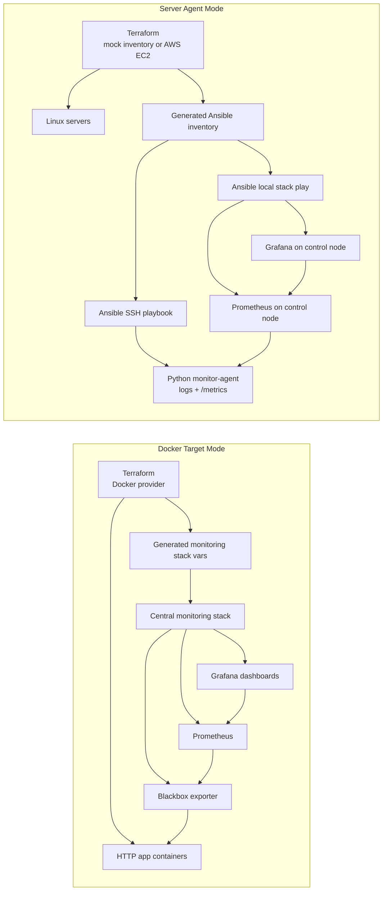

# iac-monitoring-system

這是一個以 Infrastructure as Code 為核心的 monitoring system。它使用 Terraform 描述要被管理的 Docker 或 Linux server targets，使用 Ansible 派送 Python monitoring agent 與 Prometheus/Grafana 設定，最後由 Grafana 呈現服務與主機診斷資料。

這個 system 有兩種 target mode：

- Docker Target Mode：Terraform 管理本機 Docker app containers，central Prometheus 透過 blackbox exporter 探測 HTTP health，適合快速展示資源新增、刪除、設定變更與外部探測監控。
- Server Agent Mode：Terraform 管理既有 Linux servers 或 AWS EC2 inventory，Ansible 將 Python monitoring agent 派送到遠端 servers，Prometheus/Grafana 跑在 control node 並收集 agent metrics。

Python agent 的目標類似獨立的 monitoring agent：在目標機器上收集 CPU、memory、zombie process、DNS/TCP check 等資料，寫入 log，並暴露 Prometheus `/metrics` endpoint。

## Portfolio Highlights

- 用 Terraform 管理 Docker-based simulated app nodes，支援新增、刪除和設定變更。
- 用 Terraform 產生 Ansible inventory 與 group vars，讓 Ansible 根據 desired state 更新 Prometheus targets。
- 用 Ansible 自動部署 central Prometheus/Grafana、blackbox exporter 與 dashboards。
- 用 Grafana overview/details dashboards 觀察 target health、availability、latency、HTTP status code。
- 自製 Python monitoring agent，寫入 log 並暴露 Prometheus `/metrics` endpoint。
- Server Agent Mode 可接既有 Linux servers，也可切換成 AWS EC2 provisioning flow。
- 內建 Makefile 與 GitHub Actions CI，檢查 Terraform、Ansible、Grafana JSON 和 Python agent。

## Architecture

```text
Terraform -> Ansible -> Python Agent -> /var/log/monitor-agent.log
                       -> /metrics -> Prometheus -> Grafana Dashboard
```



- Terraform：管理節點清單，輸出 server IP，並產生 `ansible/inventory.ini`
- Ansible：對遠端 server 安裝 Python agent，並在 control node 部署 single central Prometheus/Grafana stack
- Python Agent：檢查 CPU、memory、zombie process、DNS、TCP connectivity，並暴露 Prometheus metrics
- Prometheus：定期 scrape monitor-agent metrics
- Grafana：自動 provision Prometheus datasource 與 system dashboard
- systemd：開機自動啟動，失敗時自動重啟
- Python venv：agent dependencies 安裝在 `/opt/monitor-agent/venv`，避免污染系統 Python

## Features

- Automated provisioning interface：Terraform 統一維護 system target 資料與輸出
- Configuration management：Ansible 重複佈署不會破壞既有狀態
- Monitoring & diagnostics：CPU、memory、zombie process、DNS、TCP check
- Failure classification：DNS resolution error、TCP timeout、connection refused、generic socket error
- Logging：使用 Python logging 寫入 `/var/log/monitor-agent.log`
- Grafana dashboard：agent endpoint、CPU/memory sample、DNS/TCP check 狀態
- Prometheus datasource provisioning：Grafana 啟動後自動連上 Prometheus
- Bonus：YAML config、network retry、CLI override、systemd restart

## Repository Structure

```text
infra/
  docker/
    terraform/
      main.tf
      variables.tf
      outputs.tf
  server/
    terraform/
      main.tf
      variables.tf
      outputs.tf
ansible/
  server-agent.yml
  templates/server-prometheus.yml.j2
  files/grafana/
agent/
  agent.py
  config.yml
systemd/
  monitor-agent.service
requirements.txt
README.md
```

## Prerequisites

- Terraform >= 1.5
- Ansible
- Docker，用於 Docker Target Mode
- Server Agent Mode 需要 1 到 5 台可 SSH 登入的 Linux servers，或 AWS credentials 來建立 EC2
- Linux server 上的 sudo 權限
- Control node 可以連 Docker image registry，例如 Docker Hub

Server Agent Mode 預設不會建立 AWS 資源，只會用 existing server inventory。若要接既有 server，先修改 [infra/server/terraform/variables.tf](infra/server/terraform/variables.tf) 裡的 `server_hosts`；若要建立 AWS EC2，請設定 `enable_aws_resources=true`、`aws_ami_id`、SSH key 與安全群組允許的 CIDR。

可複製範例變數檔開始調整：

```bash
cp infra/docker/terraform/terraform.tfvars.example infra/docker/terraform/terraform.tfvars
cp infra/server/terraform/terraform.tfvars.example infra/server/terraform/terraform.tfvars
```

## Usage

完整操作教學請看 [docs/system-usage.zh-TW.md](docs/system-usage.zh-TW.md)。

### Fast Demo

Docker Target Mode 是最適合履歷展示的路徑，整個流程可以在本機重跑：

```bash
make docker-up ANSIBLE_FLAGS="--ask-become-pass"
make docker-scale NODE_COUNT=3 ANSIBLE_FLAGS="--ask-become-pass"
make docker-scale NODE_COUNT=1 ANSIBLE_FLAGS="--ask-become-pass"
make docker-edit ANSIBLE_FLAGS="--ask-become-pass"
```

打開 Grafana：

```text
http://localhost:3000
admin / admin
Dashboards:
- IaC Docker Target Overview
- IaC Docker Target Details
```

驗證與清除：

```bash
make validate
make docker-down ANSIBLE_FLAGS="--ask-become-pass"
```

### Server Agent Mode

預設模式只產生 Ansible inventory，不建立雲端資源，適合既有 VMware / Linux servers：

```bash
cd infra/server/terraform
terraform init
terraform apply
```

如果要真的建立 AWS EC2，請先確認 AWS credentials 已設定，再執行：

```bash
cd infra/server/terraform
terraform init
terraform apply \
  -var='enable_aws_resources=true' \
  -var='aws_ami_id=ami-xxxxxxxxxxxxxxxxx' \
  -var='ssh_public_key_file=~/.ssh/id_rsa.pub' \
  -var='ssh_private_key_file=~/.ssh/id_rsa'
```

確認 Terraform output：

```bash
terraform output server_ip_addresses
terraform output ansible_inventory_path
terraform output system_mode
terraform output grafana_url
terraform output prometheus_url
```

用 Ansible 佈署遠端 agent 與本機 monitoring stack：

```bash
cd ../../..
make server-agent ANSIBLE_FLAGS="--ask-pass --ask-become-pass"
make server-stack ANSIBLE_FLAGS="--ask-become-pass"
```

如果你的 server 已經設定 SSH key，可以省略密碼參數：

```bash
make server-agent
make server-stack ANSIBLE_FLAGS="--ask-become-pass"
```

正式環境建議改成 SSH key，避免把密碼寫進 inventory 或 repo。

打開 Grafana：

```text
URL: http://localhost:3000
Username: admin
Password: admin
Dashboard: IaC Agent Overview
```

Prometheus targets：

```text
http://localhost:9090/targets
Jobs:
- monitor-agent
```

在 Linux server 上檢查 agent：

```bash
sudo systemctl status monitor-agent
sudo journalctl -u monitor-agent -n 50 --no-pager
sudo tail -f /var/log/monitor-agent.log
curl http://localhost:8000/metrics
```

如果有建立 AWS EC2，練習完請清除資源：

```bash
cd infra/server/terraform
terraform destroy \
  -var='enable_aws_resources=true' \
  -var='aws_ami_id=ami-xxxxxxxxxxxxxxxxx' \
  -var='ssh_public_key_file=~/.ssh/id_rsa.pub'
```

本機開發時也可以只跑一次 agent：

```bash
python agent/agent.py --config agent/config.yml --log-file ./monitor-agent.log --once --disable-metrics
```

### Docker Target Mode

如果你還沒有 server，可以用 Docker 在本機模擬「新增、刪除、編輯、派送、監控」流程。

這個模式會做幾件事：

- Terraform 建立 Docker network 和多個 HTTP app containers
- Terraform 產生 `ansible/group_vars/monitoring_stack/docker_targets.yml` 與 Ansible group vars
- Ansible central stack 部署 blackbox exporter，並讓同一套 Prometheus/Grafana 監控 Docker targets
- Grafana overview dashboard 監控 app up/down 和 HTTP latency
- Grafana details dashboard 顯示 failed targets、availability、latency table 和 HTTP status code

啟動 Docker target mode：

```bash
cd infra/docker/terraform
terraform init
terraform apply

cd ../../..
make server-stack ANSIBLE_FLAGS="--ask-become-pass"
```

打開 Docker target mode UI：

```text
Grafana: http://localhost:3000
Username: admin
Password: admin
Dashboard: IaC Docker Target Overview
Details: IaC Docker Target Details

Prometheus: http://localhost:9090
```

模擬新增資源：

```bash
cd infra/docker/terraform
terraform apply -var='node_count=3'

cd ../../..
make server-stack ANSIBLE_FLAGS="--ask-become-pass"
```

模擬刪除資源：

```bash
cd infra/docker/terraform
terraform apply -var='node_count=1'

cd ../../..
make server-stack ANSIBLE_FLAGS="--ask-become-pass"
```

模擬編輯資源：

```bash
cd infra/docker/terraform
terraform apply -var='app_message_prefix=updated by terraform'
```

清掉 Docker target mode：

```bash
cd infra/docker/terraform
terraform destroy
cd ../../..
rm -f ansible/group_vars/monitoring_stack/docker_targets.yml
docker rm -f blackbox iac-lab-blackbox iac-lab-prometheus iac-lab-grafana
make server-stack ANSIBLE_FLAGS="--ask-become-pass"
```

Makefile 版本：

```bash
make docker-up ANSIBLE_FLAGS="--ask-become-pass"
make docker-scale NODE_COUNT=3 ANSIBLE_FLAGS="--ask-become-pass"
make docker-down ANSIBLE_FLAGS="--ask-become-pass"
```

## Agent Config

[agent/config.yml](agent/config.yml) 集中管理檢查週期、retry、log file 與 network target。

預設檢查：

- DNS：`www.github.com`
- TCP internal：`192.168.1.254:443`
- TCP external：`google.com:443`

## Quality Gates

本專案提供本機與 CI 共用的驗證入口：

```bash
make validate
```

檢查內容：

- Terraform fmt / validate for Docker target mode and Server Agent Mode
- Ansible syntax check for Docker target mode and Server Agent Mode playbooks
- Grafana dashboard JSON validation
- Python syntax check for `agent/agent.py`

## Design Considerations

- Lightweight agent：只做必要檢查，避免引入大型監控框架
- Separation of concerns：Terraform 管節點、Ansible 管佈署、systemd 管生命週期
- Repeatability：同一份 playbook 可以重跑，方便修正設定或更新 agent
- 維運可追：log 訊息保留 check type、target、attempts 與錯誤分類

## Future Improvements

- Centralized logging，例如 Loki、ELK 或 OpenSearch
- Alerting system，例如 Alertmanager、Teams webhook、Slack webhook
- 增加 remote backend，例如 S3 + DynamoDB lock
- 將 Ansible shell-based Docker tasks 改成 `community.docker` modules
