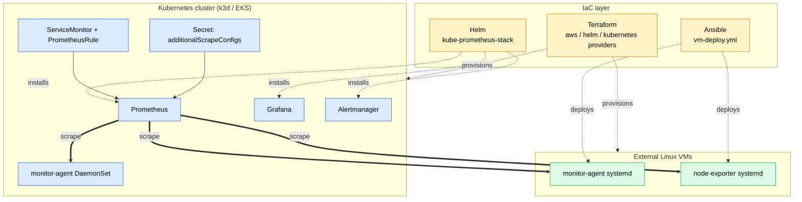
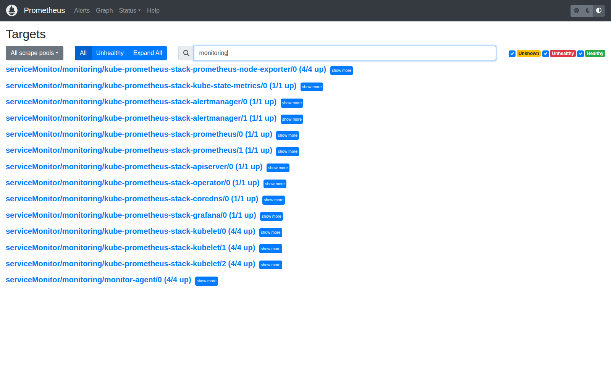
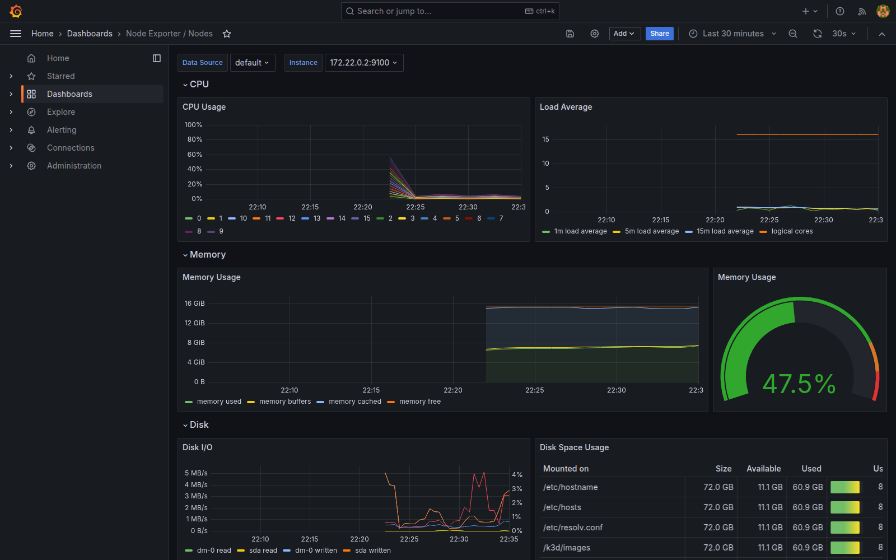
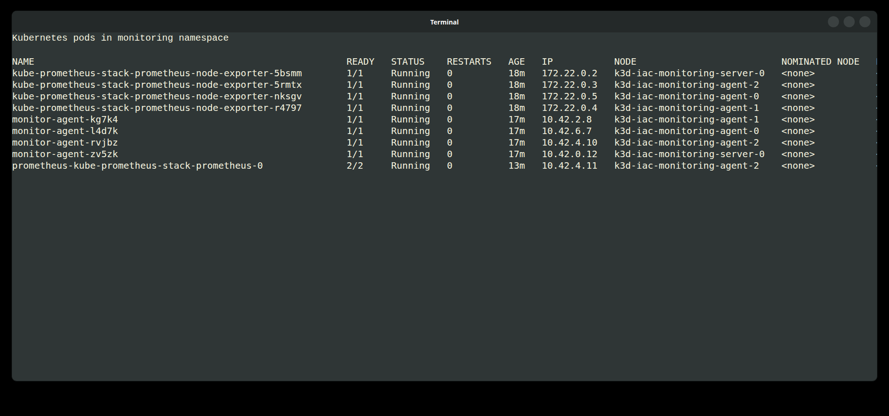
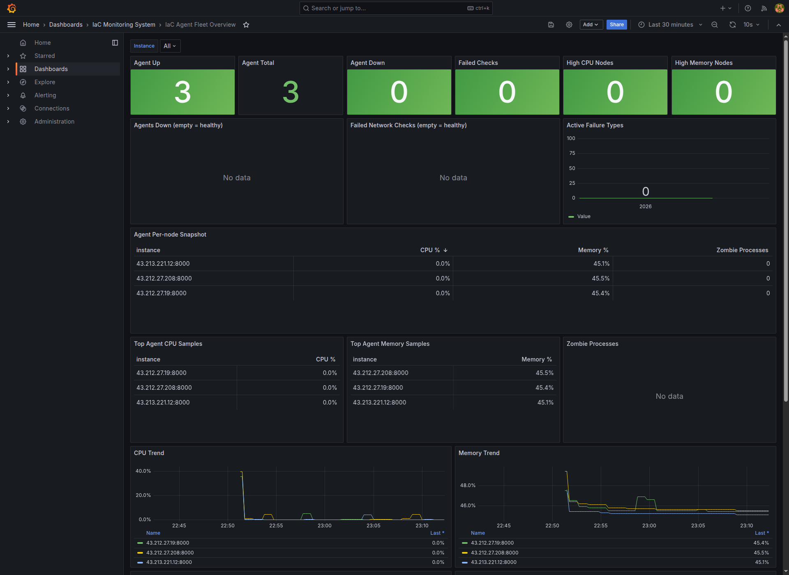
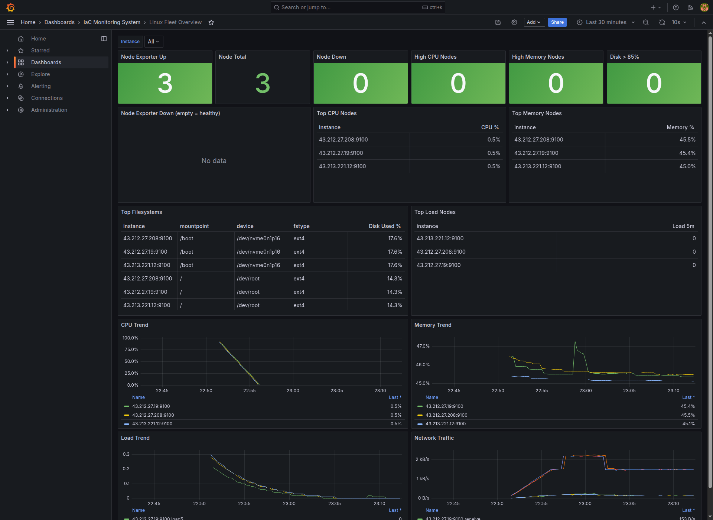

# iac-monitoring-system

一套以 **Terraform + Ansible + Helm** 建置的 hybrid 監控系統，模擬真實 SRE 場景中 **Kubernetes 與傳統 Linux VM 並存** 的混合環境，並以 IaC 方式統一管理部署、監控與告警。

系統使用 **kube-prometheus-stack** 部署 Prometheus / Grafana / Alertmanager 到 k3d（本機）或 EKS（規劃中），同時透過：

- **ServiceMonitor** 抓取 k8s 內部 workload metrics（monitor-agent DaemonSet）
- **additionalScrapeConfigs Secret** 動態管理外部 EC2 / Linux VM target

**Python monitor-agent** 同時支援兩種部署形式：在 VM 上以 systemd 執行，在 k8s 上以 DaemonSet 執行，輸出統一格式的 Prometheus metrics。

達到用同一套監控邏輯與 IaC 流程，同時覆蓋 k8s 與 VM 基礎設施。

## 使用情境

| Mode | 部署方式 | 用途 |
|------|---------|------|
| **Kubernetes** | Terraform + Helm → k3d / EKS | 主要 demo path |
| **VM (existing Linux)** | Terraform + Ansible → systemd | 接手既有 server |
| **VM (AWS EC2)** | Terraform + Ansible → systemd | 雲端 VM lab |
| **Hybrid** | 上述任二同時運作，**同一個 Prometheus 監控所有 target** | 真實混合環境 |

## 架構



## 主要元件

| 元件 | 角色 |
|------|------|
| **Terraform** | `infra/vm` 建立 EC2 + Ansible inventory；`infra/k8s` 建立 k3d cluster、安裝 Helm chart、套用 monitor-agent manifests |
| **Ansible** | VM mode 部署 monitor-agent / node-exporter / Prometheus stack（透過 docker-compose） |
| **Helm** | k8s mode 安裝 kube-prometheus-stack（含 Prometheus Operator + Grafana + Alertmanager），由 Terraform `helm_release` 管理 |
| **monitor-agent** | 自製 Python agent，採 CPU / memory / zombie process + DNS / TCP 檢查 |
| **PrometheusRule** | 6 條 alert 涵蓋 instance down / CPU / memory / disk / load |

## Demo

### Kubernetes mode (4-node k3d cluster)





### VM mode




## 專案結構

```text
agent/
  agent.py              Python monitoring agent
  test_agent.py         pytest suite
  config.yml            agent config (DNS / TCP targets)
  Dockerfile            container image for k8s mode
ansible/
  vm-deploy.yml         thin playbook composing the two roles
  roles/monitor_agent/  monitor-agent systemd role (venv + service + logrotate)
  roles/node_exporter/  Node Exporter systemd role
  templates/            docker-compose, Prometheus, Alertmanager templates
  files/grafana/        dashboards + provisioning
  files/prometheus/     alert rules (VM mode)
k8s/
  helm/values.yaml      kube-prometheus-stack overrides
  manifests/            auto-applied by Terraform: DaemonSet, ServiceMonitor, PrometheusRule
  user-managed/         hand-applied templates (external-targets Secret)
infra/
  vm/terraform/         existing Linux server / AWS EC2
  k8s/terraform/        k3d + Helm release + manifests
scripts/
  k8s-verify.sh         smoke check k8s targets
  vm-smoke.sh           deep smoke check VM targets (SSH + Ansible)
  vm-quickcheck.sh      HTTP-only quick check of VM stack endpoints
runbooks/               6 incident runbooks
```

## 部屬方式

### Kubernetes mode

需求：`docker`、`k3d`、`kubectl`、`helm`、`terraform`

```bash
make k8s-up        # 包：build agent image → terraform apply (k3d + helm + manifests)
make k8s-verify
```

完整 k8s 部署完全由 Terraform 驅動 — `infra/k8s/terraform` 內的 `helm_release`、`kubernetes_namespace`、`kubernetes_secret`、`kubernetes_config_map` 一次帶起 k3d cluster、kube-prometheus-stack、monitor-agent DaemonSet / ServiceMonitor / PrometheusRule。

- Grafana: <http://localhost:3000>（admin / admin）
- Prometheus: <http://localhost:9090>
- Alertmanager: <http://localhost:9093>

加入外部 VM target：

```bash
cp k8s/user-managed/external-targets-secret.example.yaml k8s/user-managed/external-targets-secret.yaml
# 編輯 targets 列表
kubectl -n monitoring apply -f k8s/user-managed/external-targets-secret.yaml
```

> `k8s/manifests/` 內的 manifest 由 Terraform 自動套用,使用者不需手動處理;`k8s/user-managed/` 則是放給人手動 apply 的範本。

Secret 的 `data` 在 Terraform 中標記為 `ignore_changes`，後續 `terraform apply` 不會覆寫 kubectl 寫入的 target 清單。

清除：

```bash
make k8s-down      # terraform destroy（會把 k3d cluster 一併刪除）
```

### VM mode

VM mode 走 Terraform + Ansible，分既有 Linux server 與 AWS EC2 兩條路徑，常用 make target：

| 路徑 | 建資源 | 部署 | 驗證 / 清除 |
|------|--------|------|------|
| 既有 Linux server | `make vm-apply` | `make vm-up ANSIBLE_FLAGS="--ask-become-pass"` | `make vm-smoke` |
| AWS EC2 | `make vm-aws-apply` | `make vm-aws-deploy ANSIBLE_FLAGS="--ask-become-pass"` | `make vm-smoke` / `make vm-aws-destroy` |

兩條路徑的 `terraform.tfvars` 範本與逐步驟（含 inventory 產生、debug、alert 測試）見
[docs/system-usage.zh-TW.md](docs/system-usage.zh-TW.md)。

## Alert rules

```text
InstanceDown        target /metrics 連續 2 分鐘無回應
HighCPUUsage        CPU > 85% for 5m
HighMemoryUsage     memory > 90% for 5m
DiskAlmostFull      disk > 85% for 5m
HighLoadAverage     load5 > CPU 核心數 for 5m
```

- VM mode：`ansible/files/prometheus/rules/linux-alerts.yml`
- k8s mode：`k8s/manifests/prometheusrule.yaml`（PrometheusRule CRD）

## 文件

- [docs/system-usage.zh-TW.md](docs/system-usage.zh-TW.md) — 完整部署、debug、alert 測試流程
- [docs/project-study-guide.zh-TW.md](docs/project-study-guide.zh-TW.md) — 專案元件、Kubernetes/VM mode、Terraform/Ansible 觀念整理
- [runbooks/](runbooks/) — 6 篇 incident runbook
