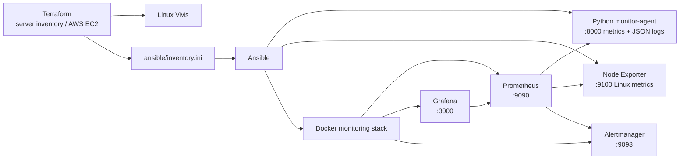

# iac-monitoring-system

用 Terraform 管 server 清單（或開 AWS EC2），Ansible 把 monitoring agent、Node Exporter 和 Prometheus/Grafana/Alertmanager 推上去，然後用 Grafana 看狀態、Prometheus 發 alert。

主要情境是 Server Agent Mode，也就是直接把 agent 裝到 Linux server 上。另外保留了一個 Docker Target Mode 當作本機 demo 用，可以讓 Prometheus blackbox 去 scrape Docker container。

## 架構



各元件分工：

- **Python agent**：跑 DNS/TCP 檢查、量 latency、記 retry 次數，結果以 JSON 寫 log 並同時暴露 `:8000/metrics` 給 Prometheus scrape。
- **Node Exporter**：收 CPU、memory、disk、network 這些標準 Linux host metrics，走 `:9100/metrics`。
- **Prometheus**：scrape agent 和 Node Exporter，觸發 alert 時通知 Alertmanager。
- **Grafana**：三個預裝 dashboard，分別對應 agent、Linux node、Docker target。
- **Alertmanager**：目前用本機 basic receiver，沒有接 Slack 或 email。

## 目錄結構

```text
infra/
  server/terraform/      Server Agent Mode inventory / 選用 AWS EC2
  docker/terraform/      Docker Target Mode local demo
ansible/
  server-agent.yml       部署 agent 和 monitoring stack
  roles/node_exporter/   Node Exporter systemd 安裝
  templates/             Prometheus / Alertmanager config 模板
  files/grafana/         Grafana dashboard provisioning
  files/prometheus/      Prometheus alert rules
agent/
  agent.py               Python monitoring agent
  config.yml             agent 預設 check 設定
runbooks/                Linux incident runbooks
scripts/
  smoke-server.sh
  verify-monitoring-stack.sh
systemd/
  monitor-agent.service
```

## 需要準備的東西

- Terraform >= 1.5
- Ansible
- Control node 上要有 Docker
- 1 到 5 台可以 SSH 進去的 Linux server，或是 AWS credentials 讓 Terraform 開 EC2
- Target server 上的 sudo 權限
- Control node 能連到 Docker Hub 拉 image

預設不會開 AWS 資源，只用 `terraform.tfvars` 裡的 server 清單產 inventory。要開 EC2 的話把 `enable_aws_resources=true` 打開，再填 AMI、VPC/subnet、SSH key、允許的 CIDR。

## 快速開始

```bash
cp infra/server/terraform/terraform.tfvars.example infra/server/terraform/terraform.tfvars
# 填入 server_hosts、ansible_user、ssh_private_key_file

make server-apply
make server-up ANSIBLE_FLAGS="--ask-become-pass"
make verify-stack
```

跑起來之後：

```text
Prometheus:    http://localhost:9090
Grafana:       http://localhost:3000  admin / admin
Alertmanager:  http://localhost:9093
```

確認 target 上的服務有跑起來：

```bash
systemctl status monitor-agent
systemctl status node_exporter
curl http://<target-ip>:8000/metrics
curl http://<target-ip>:9100/metrics
```

## Terraform

Server Agent Mode：

```bash
terraform -chdir=infra/server/terraform init
terraform -chdir=infra/server/terraform plan
terraform -chdir=infra/server/terraform apply
terraform -chdir=infra/server/terraform output
```

`output` 會印出 server IP、SSH 連線資訊、monitor-agent targets、Node Exporter targets，以及 Prometheus/Grafana/Alertmanager 的本機 URL。

AWS EC2：

```bash
cp infra/server/terraform/terraform.tfvars.aws.example infra/server/terraform/terraform.tfvars.aws
# 填 AMI、VPC、subnet、CIDR、SSH key
make server-aws-plan
make server-aws-apply
make server-aws-deploy ANSIBLE_FLAGS="--ask-become-pass"
make verify-stack
make server-aws-destroy
```

Docker Target Mode（本機 demo）：

```bash
make docker-up ANSIBLE_FLAGS="--ask-become-pass"
make docker-scale NODE_COUNT=3 ANSIBLE_FLAGS="--ask-become-pass"
make docker-down ANSIBLE_FLAGS="--ask-become-pass"
```

## Ansible

```bash
make server-agent ANSIBLE_FLAGS="--ask-become-pass"
make server-stack ANSIBLE_FLAGS="--ask-become-pass"
```

`server-agent` 裝到 Linux target 上：Python agent systemd service、Node Exporter systemd service、logrotate config。

`server-stack` 在 control node 起 Docker 的：Prometheus、Grafana、Alertmanager，以及 Docker Target Mode 有 target 時會多起 blackbox exporter。

## 監控指標

Prometheus scrape jobs：

- `prometheus`
- `monitor-agent`
- `node-exporter`
- `alertmanager`
- `docker-target-http`（只有 Docker Target Mode 有 target 時才會出現）

主要 Linux metrics：

```text
up
node_cpu_seconds_total
node_memory_MemAvailable_bytes
node_memory_MemTotal_bytes
node_filesystem_avail_bytes
node_filesystem_size_bytes
node_load1 / node_load5 / node_load15
node_network_receive_bytes_total
node_network_transmit_bytes_total
```

Python agent 的 log 格式：

```json
{"attempts":1,"detail":"connected","event":"network_check","failure_type":null,"host":"monitor-node-01","latency_ms":12.4,"level":"INFO","logged_at":"2026-05-05T20:10:00+0800","name":"external-google","ok":true,"port":443,"status":"ok","target_host":"google.com","type":"tcp","version":"1.1.0"}
```

用 `journalctl -u monitor-agent -f` 或 `tail -f /var/log/monitor-agent.log` 追蹤，也可以接 Filebeat / Promtail 集中收。

## Alerts

Alert rules 放在 `ansible/files/prometheus/rules/linux-alerts.yml`，Ansible 部署時會推到 Prometheus：

- `InstanceDown`
- `NodeExporterDown`
- `HighCPUUsage`
- `HighMemoryUsage`
- `DiskAlmostFull`
- `HighLoadAverage`

手動觸發測試：

```bash
# 觸發 NodeExporterDown
sudo systemctl stop node_exporter

# 觸發 InstanceDown（同時停掉兩個 endpoint）
sudo systemctl stop monitor-agent node_exporter

# 恢復
sudo systemctl start monitor-agent node_exporter
```

CPU、memory、disk、load 的模擬方式看 `docs/system-usage.zh-TW.md` 和 `runbooks/`。

## Runbooks

```text
runbooks/instance-down.md
runbooks/node-exporter-down.md
runbooks/disk-full.md
runbooks/high-cpu.md
runbooks/high-memory.md
runbooks/high-load.md
```

每份都有：症狀、影響範圍、初步確認指令、常見原因、修法、驗證步驟、預防方式。

## 備份與還原

設定以 Git + Ansible template 為主，不額外放 backup script。runtime 有手動改過的話可以用下面的指令備份：

```bash
backup_dir="backups/manual-$(date +%Y%m%d-%H%M%S)"
mkdir -p "$backup_dir"
sudo cp /opt/iac-monitoring-stack/prometheus.yml "$backup_dir/" 2>/dev/null || true
sudo cp /opt/iac-monitoring-stack/alertmanager.yml "$backup_dir/" 2>/dev/null || true
sudo cp -a /opt/iac-monitoring-stack/rules "$backup_dir/" 2>/dev/null || true
sudo cp -a /opt/iac-monitoring-stack/grafana/dashboards "$backup_dir/" 2>/dev/null || true
```

還原直接重跑 Ansible 就好：

```bash
make server-stack ANSIBLE_FLAGS="--ask-become-pass"
make verify-stack
```

## 驗證

部署前靜態檢查：

```bash
make validate
terraform -chdir=infra/server/terraform fmt -check
terraform -chdir=infra/server/terraform validate
ansible-playbook --syntax-check -i ansible/inventory.ini ansible/server-agent.yml
jq empty ansible/files/grafana/dashboards/*.json
bash -n scripts/verify-monitoring-stack.sh
```

部署後確認有沒有起來：

```bash
make verify-stack
curl http://localhost:9090/-/healthy
curl http://localhost:9093/-/healthy
curl http://<target-ip>:8000/metrics
curl http://<target-ip>:9100/metrics
```

## 常見問題

**Prometheus 看不到 target**
```bash
terraform -chdir=infra/server/terraform output
cat ansible/inventory.ini
curl http://localhost:9090/api/v1/targets
```

**Node Exporter 沒資料**
```bash
systemctl status node_exporter
journalctl -u node_exporter --no-pager -n 100
curl http://localhost:9100/metrics
```

**Python agent 沒資料**
```bash
systemctl status monitor-agent
journalctl -u monitor-agent --no-pager -n 100
tail -n 50 /var/log/monitor-agent.log
curl http://localhost:8000/metrics
```

**Grafana 沒 dashboard**
```bash
docker logs grafana --tail 100
ls -l /opt/iac-monitoring-stack/grafana/dashboards
make server-stack ANSIBLE_FLAGS="--ask-become-pass"
```

## 需求
psutil==5.9.8
prometheus-client==0.21.1
PyYAML==6.0.2
