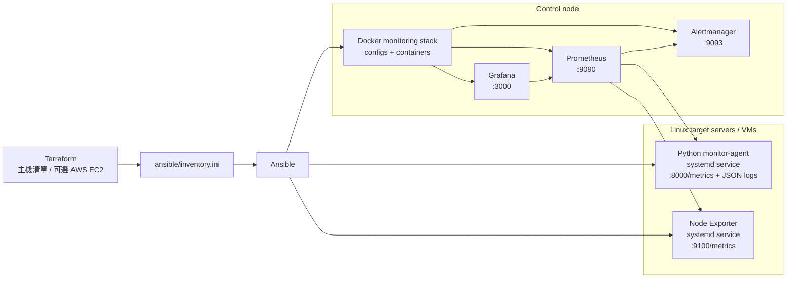

# iac-monitoring-system

這是一個用 Terraform 和 Ansible 建立的 Linux 監控實驗專案。

Terraform 負責管理目標主機清單，也可以選擇建立 AWS EC2；Ansible 則把 Python monitoring agent、Node Exporter，以及 Prometheus / Grafana / Alertmanager 監控 stack 部署起來。部署完成後，Prometheus 會自動抓取 agent 與 Node Exporter metrics，Grafana 會載入預先準備好的 dashboard，Alertmanager 則負責接收告警。

這個專案主要有兩種使用情境：

- **Server Agent Mode**：部署到真實 Linux server 或 AWS EC2。
- **Docker Target Mode**：在本機用 Docker target 快速展示監控流程。

## 架構



## 主要元件

- **Terraform**：產生 Ansible inventory，並可選擇建立 AWS EC2、Security Group、SSH key pair。
- **Ansible**：部署 agent、Node Exporter、systemd service、logrotate、Prometheus、Grafana、Alertmanager。
- **Python monitor-agent**：收集 CPU / memory / zombie process，執行 DNS / TCP check，輸出 Prometheus metrics 與 JSON log。
- **Node Exporter**：提供 Linux 主機層級 metrics，例如 CPU、memory、disk、network。
- **Prometheus**：抓取 agent、Node Exporter、Alertmanager 等目標，並載入 alert rules。
- **Grafana**：透過 provisioning 自動載入 datasource 與 dashboards。
- **Alertmanager**：接收 Prometheus alerts，目前使用本機基本 receiver。

## Demo


## 專案結構

```text
infra/
  server/terraform/      Server Agent Mode：既有 Linux server 或 AWS EC2
  docker/terraform/      Docker Target Mode：本機 demo target
ansible/
  server-agent.yml       部署 agent 與 monitoring stack
  roles/node_exporter/   安裝 Node Exporter 與 systemd service
  templates/             Prometheus / Alertmanager 設定模板
  files/grafana/         Grafana datasource 與 dashboards
  files/prometheus/      Prometheus alert rules
agent/
  agent.py               Python monitoring agent
  config.yml             預設 agent 檢查設定
docs/
  system-usage.zh-TW.md  詳細操作說明
runbooks/                Linux incident runbooks
scripts/                 驗證與 smoke test scripts
systemd/
  monitor-agent.service
```

## 前置需求

- Terraform >= 1.5
- Ansible
- Docker
- 可 SSH 登入的 Linux server，或可用的 AWS credential
- target server 需要 sudo 權限

預設不會建立 AWS 資源；只有在 `enable_aws_resources = true` 並使用 AWS tfvars 時，Terraform 才會建立 EC2。

## 快速開始

### 既有 Linux server

```bash
cp infra/server/terraform/terraform.tfvars.example infra/server/terraform/terraform.tfvars
# 編輯 server_hosts、ansible_user、ssh_private_key_file

make server-apply
make server-up ANSIBLE_FLAGS="--ask-become-pass"
make verify-stack
```

### AWS EC2

```bash
cp infra/server/terraform/terraform.tfvars.aws.example infra/server/terraform/terraform.tfvars.aws
# 編輯 AMI、VPC、subnet、SSH key、allowed CIDR

make server-aws-plan
make server-aws-apply
make server-aws-deploy ANSIBLE_FLAGS="--ask-become-pass"
make verify-stack
```

AWS demo 結束後記得清除資源：

```bash
make server-aws-destroy
```

### 本機 Docker demo

```bash
make docker-up ANSIBLE_FLAGS="--ask-become-pass"
make docker-scale NODE_COUNT=3 ANSIBLE_FLAGS="--ask-become-pass"
make docker-down ANSIBLE_FLAGS="--ask-become-pass"
```

## 服務入口

部署完成後，control node 會提供：

```text
Prometheus:    http://localhost:9090
Grafana:       http://localhost:3000  admin / admin
Alertmanager:  http://localhost:9093
```

target server 上會有：

```text
monitor-agent: http://<target-ip>:8000/metrics
Node Exporter: http://<target-ip>:9100/metrics
```

## 驗證

```bash
make verify-stack
curl http://localhost:9090/-/healthy
curl http://localhost:9093/-/healthy
curl http://<target-ip>:8000/metrics
curl http://<target-ip>:9100/metrics
```

常用 service 檢查：

```bash
systemctl status monitor-agent
systemctl status node_exporter
journalctl -u monitor-agent -f
```

## Alert Rules

目前包含：

- `InstanceDown`
- `NodeExporterDown`
- `HighCPUUsage`
- `HighMemoryUsage`
- `DiskAlmostFull`
- `HighLoadAverage`

Alert rules 位於：

```text
ansible/files/prometheus/rules/linux-alerts.yml
```

## 文件

更完整的部署流程、AWS 操作、Docker demo、alert 測試與 troubleshooting 請看：

- [docs/system-usage.zh-TW.md](docs/system-usage.zh-TW.md)
- [runbooks/](runbooks/)
