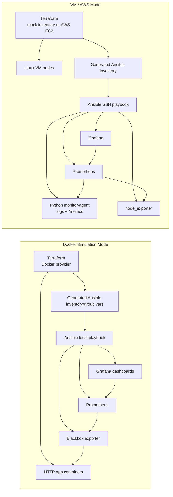

# iac-monitoring-agent

這是一個輕量級 Infrastructure as Code 教學專案，用來示範 DevOps / SRE 常見流程：先用 Terraform 管理基礎設施資訊，再用 Ansible 佈署 Python monitoring agent、node_exporter、Prometheus 與 Grafana，最後用 Grafana dashboard 呈現監控結果。

這份 lab 有兩種路線：Docker simulation mode 可以完全在本機練習 IaC 流程；VM lab mode 預設用 mock inventory 示範 Terraform 與 Ansible 的銜接，也可以打開 AWS EC2 模式，讓 Terraform 建立 VM，再交給 Ansible 部署 monitoring stack。

## Portfolio Highlights

- 用 Terraform 管理 Docker-based simulated app nodes，支援新增、刪除和設定變更。
- 用 Terraform 產生 Ansible inventory 與 group vars，讓 Ansible 根據 desired state 更新 Prometheus targets。
- 用 Ansible 自動部署 blackbox exporter、Prometheus、Grafana dashboards。
- 用 Grafana overview/details dashboards 觀察 target health、availability、latency、HTTP status code。
- 自製 Python monitoring agent，寫入 log 並暴露 Prometheus `/metrics` endpoint。
- VM lab 可用 mock inventory 練習，也可切換成 AWS EC2 provisioning flow。
- 內建 Makefile 與 GitHub Actions CI，檢查 Terraform、Ansible、Grafana JSON 和 Python agent。

## Architecture

```text
Terraform -> Ansible -> Python Agent -> /var/log/monitor-agent.log
                       -> node_exporter -> Prometheus -> Grafana Dashboard
```



- Terraform：管理節點清單、網段資訊，輸出 VM IP，並產生 `ansible/inventory.ini`
- Ansible：安裝 Python 套件、複製 agent/config/service，啟用 systemd，部署 Docker containers
- Python Agent：檢查 CPU、memory、zombie process、DNS、TCP connectivity，並暴露 Prometheus metrics
- node_exporter：輸出 Linux host metrics 給 Prometheus
- Prometheus：定期 scrape node_exporter metrics
- Grafana：自動 provision Prometheus datasource 與 lab dashboard
- systemd：開機自動啟動，失敗時自動重啟
- Python venv：agent dependencies 安裝在 `/opt/monitor-agent/venv`，避免污染系統 Python

## Features

- Automated provisioning interface：Terraform 統一維護 lab 節點資料與輸出
- Configuration management：Ansible 重複佈署不會破壞既有狀態
- Monitoring & diagnostics：CPU、memory、zombie process、DNS、TCP check
- Failure classification：DNS resolution error、TCP timeout、connection refused、generic socket error
- Logging：使用 Python logging 寫入 `/var/log/monitor-agent.log`
- Grafana dashboard：CPU、memory、disk、node up/down 狀態
- Prometheus datasource provisioning：Grafana 啟動後自動連上 Prometheus
- Bonus：YAML config、network retry、CLI override、systemd restart

## Repository Structure

```text
labs/
  docker/
    terraform/
      main.tf
      variables.tf
      outputs.tf
  vm/
    terraform/
      main.tf
      variables.tf
      outputs.tf
ansible/
  playbook.yml
  docker-lab.yml
  templates/prometheus.yml.j2
  files/grafana/
  roles/
agent/
  agent.py
  config.yml
systemd/
  monitor-agent.service
requirements.txt
README.md
```

## Prerequisites

- Terraform >= 1.5
- Ansible
- Docker，用於 Docker simulation mode
- VM lab mode 需要 1 到 2 台可 SSH 登入的 Linux VM，或 AWS credentials 來建立 EC2
- Linux VM 上的 sudo 權限
- VM 可以連 Docker image registry，例如 Docker Hub、Quay.io

VM lab 預設不會建立 AWS 資源，只會用 mock inventory 展示流程。若要接既有 VM，先修改 [labs/vm/terraform/variables.tf](labs/vm/terraform/variables.tf) 裡的 `mock_vm_hosts`；若要建立 AWS EC2，請設定 `enable_aws_resources=true`、`aws_ami_id`、SSH key 與安全群組允許的 CIDR。

可複製範例變數檔開始調整：

```bash
cp labs/docker/terraform/terraform.tfvars.example labs/docker/terraform/terraform.tfvars
cp labs/vm/terraform/terraform.tfvars.example labs/vm/terraform/terraform.tfvars
```

## Usage

完整操作教學請看 [docs/lab-usage.zh-TW.md](docs/lab-usage.zh-TW.md)。

### Fast Demo

Docker simulation mode 是最適合履歷展示的路徑，整個流程可以在本機重跑：

```bash
make docker-up
make docker-scale NODE_COUNT=3
make docker-scale NODE_COUNT=1
make docker-edit
```

打開 Grafana：

```text
http://localhost:13000
admin / admin
Dashboards:
- IaC Docker Lab Overview
- IaC Docker Lab Details
```

驗證與清除：

```bash
make validate
make docker-down
```

### VM Lab Mode

預設模式只產生 Ansible inventory，不建立雲端資源：

```bash
cd labs/vm/terraform
terraform init
terraform apply
```

如果要真的建立 AWS EC2，請先確認 AWS credentials 已設定，再執行：

```bash
cd labs/vm/terraform
terraform init
terraform apply \
  -var='enable_aws_resources=true' \
  -var='aws_ami_id=ami-xxxxxxxxxxxxxxxxx' \
  -var='ssh_public_key_file=~/.ssh/id_rsa.pub' \
  -var='ssh_private_key_file=~/.ssh/id_rsa'
```

確認 Terraform output：

```bash
terraform output vm_ip_addresses
terraform output ansible_inventory_path
terraform output lab_mode
terraform output grafana_url
terraform output prometheus_url
```

用 Ansible 佈署 agent 與 monitoring stack：

```bash
cd ../../..
ansible-playbook -i ansible/inventory.ini ansible/playbook.yml
```

打開 Grafana：

```text
URL: http://<第一台 VM IP>:3000
Username: admin
Password: admin
Dashboard: IaC Monitoring Lab Overview
Agent Dashboard: IaC Agent Overview
```

Prometheus targets：

```text
http://<第一台 VM IP>:9090/targets
Jobs:
- node-exporter
- monitor-agent
```

在 Linux VM 上檢查服務：

```bash
sudo systemctl status monitor-agent
sudo journalctl -u monitor-agent -n 50 --no-pager
sudo tail -f /var/log/monitor-agent.log
curl http://localhost:8000/metrics
sudo docker ps
```

如果有建立 AWS EC2，練習完請清除資源：

```bash
cd labs/vm/terraform
terraform destroy \
  -var='enable_aws_resources=true' \
  -var='aws_ami_id=ami-xxxxxxxxxxxxxxxxx' \
  -var='ssh_public_key_file=~/.ssh/id_rsa.pub'
```

本機開發時也可以只跑一次 agent：

```bash
python agent/agent.py --config agent/config.yml --log-file ./monitor-agent.log --once --disable-metrics
```

### Docker Simulation Mode

如果你還沒有 VM，可以用 Docker 在本機模擬「新增、刪除、編輯、派送、監控」流程。

這個模式會做幾件事：

- Terraform 建立 Docker network 和多個 HTTP app containers
- Terraform 產生 `ansible/docker-lab-inventory.ini` 與 Ansible group vars
- Ansible 部署 blackbox exporter、Prometheus、Grafana containers
- Grafana overview dashboard 監控 app up/down 和 HTTP latency
- Grafana details dashboard 顯示 failed targets、availability、latency table 和 HTTP status code

啟動 Docker lab：

```bash
cd labs/docker/terraform
terraform init
terraform apply

cd ../../..
ansible-playbook -i ansible/docker-lab-inventory.ini ansible/docker-lab.yml
```

打開 Docker lab UI：

```text
Grafana: http://localhost:13000
Username: admin
Password: admin
Dashboard: IaC Docker Lab Overview
Details: IaC Docker Lab Details

Prometheus: http://localhost:19090
```

模擬新增資源：

```bash
cd labs/docker/terraform
terraform apply -var='node_count=3'

cd ../../..
ansible-playbook -i ansible/docker-lab-inventory.ini ansible/docker-lab.yml
```

模擬刪除資源：

```bash
cd labs/docker/terraform
terraform apply -var='node_count=1'

cd ../../..
ansible-playbook -i ansible/docker-lab-inventory.ini ansible/docker-lab.yml
```

模擬編輯資源：

```bash
cd labs/docker/terraform
terraform apply -var='app_message_prefix=updated by terraform'
```

清掉 Docker lab：

```bash
cd labs/docker/terraform
terraform destroy
docker rm -f iac-lab-blackbox iac-lab-prometheus iac-lab-grafana
```

Makefile 版本：

```bash
make docker-up
make docker-scale NODE_COUNT=3
make docker-down
```

## Agent Config

[agent/config.yml](agent/config.yml) 集中管理檢查週期、retry、log file 與 network target。

預設檢查：

- DNS：`www.graid.com`
- TCP internal：`192.168.1.254:443`
- TCP external：`google.com:443`

## What This Lab Proves

這份 lab 可以拿來證明你至少做過以下事情：

- Terraform：用 variables 管理 lab nodes，產生 Ansible inventory，輸出 Grafana/Prometheus URLs
- AWS provider：可選擇建立 EC2、security group、key pair，再交給 Ansible 接手設定
- Ansible：用 playbook 安裝 OS packages、部署 config、建立 systemd service、啟動 containers
- Linux service：用 systemd 管理 Python monitoring agent
- Custom metrics：Python agent 暴露 Prometheus `/metrics`，Grafana 可直接呈現 agent checks
- Prometheus：從 Terraform/Ansible 管理的節點 scrape node_exporter metrics
- Grafana：用 provisioning 自動建立 datasource 和 dashboard，不靠手動點 UI
- Troubleshooting：可用 `journalctl`、`docker ps`、Prometheus targets、Grafana panels 查問題
- Docker simulation：不用 VM 也能用 Terraform 管理容器資源，並用 Ansible 派送監控 stack
- CI validation：用 GitHub Actions 檢查 Terraform fmt/validate、Ansible syntax、Grafana dashboard JSON 和 Python syntax

建議 VM demo 流程：

1. 修改 `labs/vm/terraform/variables.tf` 的 mock VM IP，或設定 AWS EC2 相關變數
2. 執行 `terraform apply`，展示產生的 `ansible/inventory.ini`
3. 執行 `ansible-playbook -i ansible/inventory.ini ansible/playbook.yml`
4. 打開 Prometheus `/targets`，確認 node-exporter target 是 up
5. 打開 Grafana dashboard，展示 CPU、memory、disk、node status
6. 停掉其中一台 VM 或防火牆擋 `9100`，展示 Prometheus/Grafana 狀態變化

建議 Docker demo 流程：

1. `make docker-up` 建立 app containers 與 monitoring stack
2. 打開 Grafana overview，看 target count 和 health
3. `make docker-scale NODE_COUNT=3` 展示新增資源
4. `make docker-scale NODE_COUNT=1` 展示刪除資源
5. `docker stop iac-lab-app-node-01` 展示 target down
6. 切到 details dashboard，看 failed targets、availability 和 latency table

## Quality Gates

本專案提供本機與 CI 共用的驗證入口：

```bash
make validate
```

檢查內容：

- Terraform fmt / validate for Docker lab and VM lab
- Ansible syntax check for Docker lab and VM lab playbooks
- Grafana dashboard JSON validation
- Python syntax check for `agent/agent.py`

## Design Considerations

- Lightweight agent：只做必要檢查，避免引入大型監控框架
- Separation of concerns：Terraform 管節點、Ansible 管佈署、systemd 管生命週期
- Repeatability：同一份 playbook 可以重跑，方便修正設定或更新 agent
- 維運可追：log 訊息保留 check type、target、attempts 與錯誤分類

## Future Improvements

- Centralized logging，例如 Loki、ELK 或 OpenSearch
- Alerting system，例如 Alertmanager、Teams webhook、Slack webhook
- 增加 remote backend，例如 S3 + DynamoDB lock
- 將 Ansible shell-based Docker tasks 改成 `community.docker` modules
