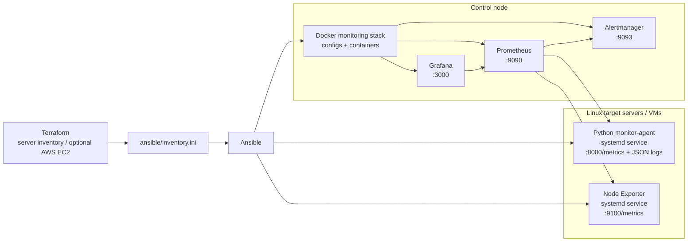

# iac-monitoring-system

Terraform manages the server inventory (or spins up AWS EC2s), Ansible pushes a Python monitoring agent, Node Exporter, and a Prometheus/Grafana/Alertmanager stack onto each host. The whole thing wires up automatically — Prometheus scrapes both the agent and Node Exporter, Grafana has dashboards provisioned out of the box, and Alertmanager fires alerts when thresholds are crossed.

The main use case is **Server Agent Mode**: deploy the agent to real Linux servers. There's also a **Docker Target Mode** for a quick local demo where Prometheus scrapes Docker containers via blackbox exporter — handy for showing off the Terraform inventory workflow without needing actual servers.

## Architecture 



What each piece does:

- **Python agent** — DNS/TCP checks, latency measurement, retry tracking, structured JSON logs. Also exposes `:8000/metrics` for Prometheus to scrape.
- **Node Exporter** — standard Linux host metrics (CPU, memory, disk, network) on `:9100/metrics`.
- **Prometheus** — scrapes the agent and Node Exporter, routes alerts to Alertmanager.
- **Grafana** — three pre-provisioned dashboards: agent checks, Linux node overview, Docker targets.
- **Alertmanager** — configured with a local basic receiver. No Slack or email hooks at the moment.

## Repository Structure

```text
infra/
  server/terraform/      Server Agent Mode inventory / optional AWS EC2
  docker/terraform/      Docker Target Mode local demo
ansible/
  server-agent.yml       Deploy agents and Docker-based monitoring stack
  roles/node_exporter/   Install Node Exporter with systemd
  templates/             Prometheus and Alertmanager config templates
  files/grafana/         Provisioned Grafana dashboards
  files/prometheus/      Prometheus alert rules
agent/
  agent.py               Python monitoring agent
  config.yml             Default agent checks
runbooks/                Linux incident runbooks
scripts/
  smoke-server.sh
  verify-monitoring-stack.sh
systemd/
  monitor-agent.service
```

## Demo


## Prerequisites

- Terraform >= 1.5
- Ansible
- Docker on the control node (for the monitoring stack)
- 1–5 Linux servers you can SSH into, or AWS credentials if you want Terraform to create EC2s
- sudo on the target servers
- Control node needs to reach Docker Hub to pull images

By default no AWS resources are created — Terraform just reads `terraform.tfvars` and generates an Ansible inventory. To actually provision EC2s, set `enable_aws_resources=true` and fill in the AMI, VPC/subnet, SSH key, and allowed CIDR.

## Quick Start

```bash
cp infra/server/terraform/terraform.tfvars.example infra/server/terraform/terraform.tfvars
# fill in server_hosts, ansible_user, ssh_private_key_file

make server-apply
make server-up ANSIBLE_FLAGS="--ask-become-pass"
make verify-stack
```

Once everything's up:

```text
Prometheus:    http://localhost:9090
Grafana:       http://localhost:3000  admin / admin
Alertmanager:  http://localhost:9093
```

Verify the agent and Node Exporter are running on each target:

```bash
systemctl status monitor-agent
systemctl status node_exporter
curl http://<target-ip>:8000/metrics
curl http://<target-ip>:9100/metrics
```

## Terraform

Server Agent Mode:

```bash
terraform -chdir=infra/server/terraform init
terraform -chdir=infra/server/terraform plan
terraform -chdir=infra/server/terraform apply
terraform -chdir=infra/server/terraform output
```

`output` prints server IPs, SSH connection info, monitor-agent and Node Exporter target URLs, and the local Prometheus/Grafana/Alertmanager URLs.

AWS EC2:

```bash
cp infra/server/terraform/terraform.tfvars.aws.example infra/server/terraform/terraform.tfvars.aws
# fill in AMI, VPC, subnet, CIDR, SSH key
make server-aws-plan
make server-aws-apply
make server-aws-deploy ANSIBLE_FLAGS="--ask-become-pass"
make verify-stack
make server-aws-destroy
```

Docker Target Mode (local demo only):

```bash
make docker-up ANSIBLE_FLAGS="--ask-become-pass"
make docker-scale NODE_COUNT=3 ANSIBLE_FLAGS="--ask-become-pass"
make docker-down ANSIBLE_FLAGS="--ask-become-pass"
```

## Ansible

```bash
make server-agent ANSIBLE_FLAGS="--ask-become-pass"
make server-stack ANSIBLE_FLAGS="--ask-become-pass"
```

`server-agent` installs on each Linux target: Python monitor-agent systemd service, Node Exporter systemd service, logrotate config.

`server-stack` deploys on the control node via Docker: Prometheus, Grafana, Alertmanager, and blackbox exporter (only when Docker Target Mode has targets).

## Monitoring Targets

Prometheus scrape jobs:

- `prometheus`
- `monitor-agent`
- `node-exporter`
- `alertmanager`
- `docker-target-http` (only present when Docker Target Mode targets exist)

Key Linux metrics from Node Exporter:

```text
up
node_cpu_seconds_total
node_memory_MemAvailable_bytes
node_memory_MemTotal_bytes
node_filesystem_avail_bytes
node_filesystem_size_bytes
node_load1 / node_load5 / node_load15
node_network_receive_bytes_total
node_network_transmit_bytes_total
```

Agent log format (one JSON object per line):

```json
{"attempts":1,"detail":"connected","event":"network_check","failure_type":null,"host":"monitor-node-01","latency_ms":12.4,"level":"INFO","logged_at":"2026-05-05T20:10:00+0800","name":"external-google","ok":true,"port":443,"status":"ok","target_host":"google.com","type":"tcp","version":"1.1.0"}
```

Follow logs with `journalctl -u monitor-agent -f` or `tail -f /var/log/monitor-agent.log`. The JSON format makes it easy to pipe into Filebeat, Promtail, or just `jq`.

Agent Prometheus metrics:

```text
monitor_agent_cpu_percent
monitor_agent_memory_percent
monitor_agent_zombie_process_count
monitor_agent_network_check_success
monitor_agent_network_check_attempts
monitor_agent_network_check_last_run_timestamp_seconds
monitor_agent_network_check_latency_ms
monitor_agent_network_check_failure
```

`monitor_agent_network_check_latency_ms` and `monitor_agent_network_check_failure` are used by the Grafana fleet dashboard for latency trend and failure type breakdown. Existing metric names are kept for compatibility.

Grafana dashboards include an `instance` dropdown. Leave it on `All` for fleet overview, or select one node when you need a focused investigation.

## Alerts

Rules live in `ansible/files/prometheus/rules/linux-alerts.yml` and get pushed to Prometheus by Ansible:

- `InstanceDown`
- `NodeExporterDown`
- `HighCPUUsage`
- `HighMemoryUsage`
- `DiskAlmostFull`
- `HighLoadAverage`

To test alerts manually:

```bash
# trigger NodeExporterDown
sudo systemctl stop node_exporter

# trigger InstanceDown (both endpoints down)
sudo systemctl stop monitor-agent node_exporter

# recover
sudo systemctl start monitor-agent node_exporter
```

For simulating CPU/memory/disk/load pressure, see `docs/system-usage.zh-TW.md` and the runbooks.

## Runbooks

```text
runbooks/instance-down.md
runbooks/node-exporter-down.md
runbooks/disk-full.md
runbooks/high-cpu.md
runbooks/high-memory.md
runbooks/high-load.md
```

Each runbook covers: symptoms, blast radius, initial checks, investigation commands, common root causes, fix steps, validation, and prevention.

## Backup and Restore

Config lives in Git and Ansible templates, so the canonical restore path is just re-running Ansible. If you've made manual runtime changes you want to preserve:

```bash
backup_dir="backups/manual-$(date +%Y%m%d-%H%M%S)"
mkdir -p "$backup_dir"
sudo cp /opt/iac-monitoring-stack/prometheus.yml "$backup_dir/" 2>/dev/null || true
sudo cp /opt/iac-monitoring-stack/alertmanager.yml "$backup_dir/" 2>/dev/null || true
sudo cp -a /opt/iac-monitoring-stack/rules "$backup_dir/" 2>/dev/null || true
sudo cp -a /opt/iac-monitoring-stack/grafana/dashboards "$backup_dir/" 2>/dev/null || true
```

To restore from Ansible (recommended):

```bash
make server-stack ANSIBLE_FLAGS="--ask-become-pass"
make verify-stack
```

## Validation

Before deploying:

```bash
make validate
terraform -chdir=infra/server/terraform fmt -check
terraform -chdir=infra/server/terraform validate
ansible-playbook --syntax-check -i ansible/inventory.ini ansible/server-agent.yml
jq empty ansible/files/grafana/dashboards/*.json
bash -n scripts/verify-monitoring-stack.sh
```

After deploying:

```bash
make verify-stack
curl http://localhost:9090/-/healthy
curl http://localhost:9093/-/healthy
curl http://<target-ip>:8000/metrics
curl http://<target-ip>:9100/metrics
```

## Troubleshooting

**Prometheus not seeing targets**
```bash
terraform -chdir=infra/server/terraform output
cat ansible/inventory.ini
curl http://localhost:9090/api/v1/targets
```

**Node Exporter not reporting**
```bash
systemctl status node_exporter
journalctl -u node_exporter --no-pager -n 100
curl http://localhost:9100/metrics
```

**Python agent not reporting**
```bash
systemctl status monitor-agent
journalctl -u monitor-agent --no-pager -n 100
tail -n 50 /var/log/monitor-agent.log
curl http://localhost:8000/metrics
```

**Grafana dashboards missing**
```bash
docker logs grafana --tail 100
ls -l /opt/iac-monitoring-stack/grafana/dashboards
make server-stack ANSIBLE_FLAGS="--ask-become-pass"
```
