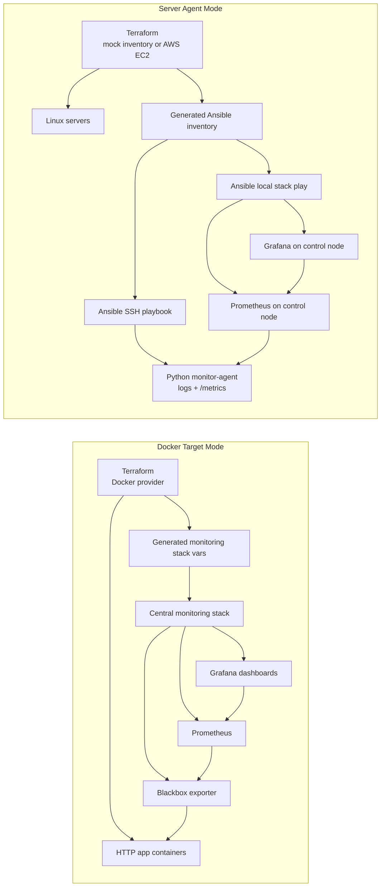

# iac-monitoring-system

這是一個以 Infrastructure as Code 為核心的 monitoring system。它使用 Terraform 描述要被管理的 Docker 或 Linux server targets，使用 Ansible 派送 Python monitoring agent 與 Prometheus/Grafana 設定，最後由 Grafana 呈現服務與主機診斷資料。

這個 system 有兩種 target mode：

- Docker Target Mode：Terraform 管理本機 Docker app containers，central Prometheus 透過 blackbox exporter 探測 HTTP health，適合快速展示資源新增、刪除、設定變更與外部探測監控。
- Server Agent Mode：Terraform 管理既有 Linux servers 或 AWS EC2 inventory，Ansible 將 Python monitoring agent 派送到遠端 servers，Prometheus/Grafana 跑在 control node 並收集 agent metrics。

Python agent 的目標類似獨立的 monitoring agent：在目標機器上收集 CPU、memory、zombie process、DNS/TCP check 等資料，寫入 log，並暴露 Prometheus `/metrics` endpoint。

## Portfolio Highlights

- 用 Terraform 管理 Docker-based simulated app nodes，支援新增、刪除和設定變更。
- 用 Terraform 產生 Ansible inventory 與 group vars，讓 Ansible 根據 desired state 更新 Prometheus targets。
- 用 Ansible 自動部署 central Prometheus/Grafana、blackbox exporter 與 dashboards。
- 用 Grafana overview/details dashboards 觀察 target health、availability、latency、HTTP status code。
- 自製 Python monitoring agent，寫入 log 並暴露 Prometheus `/metrics` endpoint。
- Server Agent Mode 可接既有 Linux servers，也可切換成 AWS EC2 provisioning flow。
- 內建 Makefile 與 GitHub Actions CI，檢查 Terraform、Ansible、Grafana JSON 和 Python agent。

## Architecture

```text
Terraform -> Ansible -> Python Agent -> /var/log/monitor-agent.log
                       -> /metrics -> Prometheus -> Grafana Dashboard
```



- Terraform：管理節點清單，輸出 server IP，並產生 `ansible/inventory.ini`
- Ansible：對遠端 server 安裝 Python agent，並在 control node 部署 single central Prometheus/Grafana stack
- Python Agent：檢查 CPU、memory、zombie process、DNS、TCP connectivity，並暴露 Prometheus metrics
- Prometheus：定期 scrape monitor-agent metrics
- Grafana：自動 provision Prometheus datasource 與 system dashboard
- systemd：開機自動啟動，失敗時自動重啟
- Python venv：agent dependencies 安裝在 `/opt/monitor-agent/venv`，避免污染系統 Python

## Features

- Automated provisioning interface：Terraform 統一維護 system target 資料與輸出
- Configuration management：Ansible 重複佈署不會破壞既有狀態
- Monitoring & diagnostics：CPU、memory、zombie process、DNS、TCP check
- Failure classification：DNS resolution error、TCP timeout、connection refused、generic socket error
- Structured logging：agent 以 JSON event 寫入 `/var/log/monitor-agent.log`，同時輸出到 journald
- Log lifecycle：Ansible 會派送 logrotate 設定，避免長跑後 log 無限制成長
- Grafana dashboard：agent endpoint、CPU/memory sample、DNS/TCP check 狀態
- Prometheus datasource provisioning：Grafana 啟動後自動連上 Prometheus
- Bonus：YAML config、network retry、CLI override、systemd restart

## Repository Structure

```text
infra/
  docker/
    terraform/
      main.tf
      variables.tf
      outputs.tf
  server/
    terraform/
      main.tf
      variables.tf
      outputs.tf
ansible/
  server-agent.yml
  templates/server-prometheus.yml.j2
  files/grafana/
agent/
  agent.py
  config.yml
systemd/
  monitor-agent.service
AGENTS.md
requirements.txt
README.md
```

## Prerequisites

- Terraform >= 1.5
- Ansible
- Docker，用於 Docker Target Mode
- Server Agent Mode 需要 1 到 5 台可 SSH 登入的 Linux servers，或 AWS credentials 來建立 EC2
- Linux server 上的 sudo 權限
- Control node 可以連 Docker image registry，例如 Docker Hub

Server Agent Mode 預設不會建立 AWS 資源，只會用 existing server inventory。若要接既有 server，先修改 [infra/server/terraform/variables.tf](infra/server/terraform/variables.tf) 裡的 `server_hosts`；若要建立 AWS EC2，請設定 `enable_aws_resources=true`、`aws_ami_id`、SSH key 與安全群組允許的 CIDR。

可複製範例變數檔開始調整：

```bash
cp infra/docker/terraform/terraform.tfvars.example infra/docker/terraform/terraform.tfvars
cp infra/server/terraform/terraform.tfvars.example infra/server/terraform/terraform.tfvars
```

## Usage

完整操作教學請看 [docs/system-usage.zh-TW.md](docs/system-usage.zh-TW.md)。


## Agent Config

[agent/config.yml](agent/config.yml) 集中管理檢查週期、retry、log file 與 network target。

agent log 會以 JSON event 格式輸出，方便用 `journalctl`、`tail` 或集中式 log collector 搜尋：

```json
{"attempts":1,"detail":"connected","event":"network_check","failure_type":null,"host":"monitor-node-01","latency_ms":12.4,"level":"INFO","logged_at":"2026-05-05T20:10:00+0800","name":"external-google","ok":true,"port":443,"status":"ok","target_host":"google.com","type":"tcp","version":"1.1.0"}
```

預設檢查：

- DNS：`www.github.com`
- TCP internal：`192.168.1.254:443`
- TCP external：`google.com:443`

## Demo


