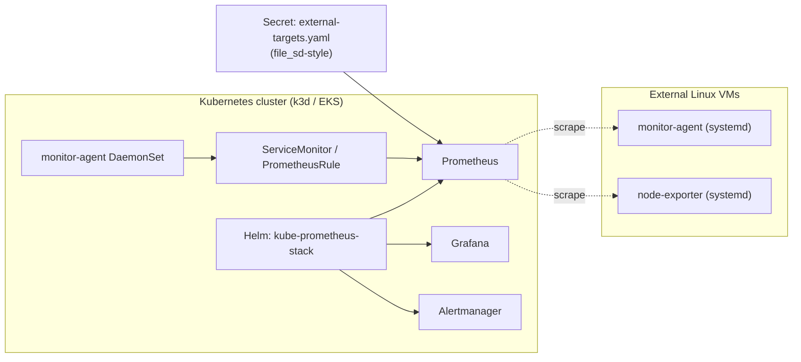

# iac-monitoring-system

一套以 **Terraform + Ansible + Helm** 建置的 hybrid 監控系統，模擬真實 SRE 場景中 **Kubernetes 與傳統 Linux VM 並存** 的混合環境，並以 IaC 方式統一管理部署、監控與告警。

系統使用 **kube-prometheus-stack** 部署 Prometheus / Grafana / Alertmanager 到 k3d（本機）或 EKS（規劃中），同時透過：

- **ServiceMonitor** 抓取 k8s 內部 workload metrics（monitor-agent DaemonSet）
- **additionalScrapeConfigs Secret** 動態管理外部 EC2 / Linux VM target

自行開發的 **Python monitor-agent** 同時支援兩種部署形式：在 VM 上以 systemd 執行，在 k8s 上以 DaemonSet 執行，輸出統一格式的 Prometheus metrics。

> **設計目標：** 用同一套監控邏輯與 IaC 流程，同時覆蓋 k8s 與 VM 基礎設施。

## 使用情境

| Mode | 部署方式 | 用途 |
|------|---------|------|
| **Kubernetes** | Terraform + Helm → k3d / EKS | 主要 demo path |
| **VM (existing Linux)** | Terraform + Ansible → systemd | 接手既有 server |
| **VM (AWS EC2)** | Terraform + Ansible → systemd | 雲端 VM lab |
| **Hybrid** | 上述任二同時運作，**同一個 Prometheus 監控所有 target** | 真實混合環境 |

## 架構



## 主要元件

| 元件 | 角色 |
|------|------|
| **Terraform** | `infra/vm` 建立 EC2 + Ansible inventory；`infra/k8s` 建立 k3d cluster + 安裝 Helm chart |
| **Ansible** | VM mode 部署 monitor-agent / node-exporter / Prometheus stack（透過 docker-compose） |
| **Helm** | k8s mode 安裝 kube-prometheus-stack（含 Prometheus Operator + Grafana + Alertmanager） |
| **monitor-agent** | 自製 Python agent，採 CPU / memory / zombie process + DNS / TCP 檢查 |
| **PrometheusRule** | 6 條 alert 涵蓋 instance down / CPU / memory / disk / load |

## Demo


## 專案結構

```text
agent/
  agent.py              Python monitoring agent
  config.yml            agent config (DNS / TCP targets)
  Dockerfile            container image for k8s mode
ansible/
  vm-deploy.yml         deploy agent + Prometheus stack to VMs
  roles/node_exporter/  Node Exporter systemd role
  templates/            docker-compose, Prometheus, Alertmanager templates
  files/grafana/        dashboards + provisioning
  files/prometheus/     alert rules (VM mode)
k8s/
  helm/values.yaml      kube-prometheus-stack overrides
  manifests/            DaemonSet, ServiceMonitor, PrometheusRule, external-targets Secret
infra/
  vm/terraform/         existing Linux server / AWS EC2
  k8s/terraform/        k3d + Helm release
  docker/terraform/     (frozen) local Docker target lab
scripts/
  k8s-up.sh             one-shot k3d + Helm bootstrap
  k8s-verify.sh         smoke check k8s targets
  smoke-server.sh       smoke check VM targets
runbooks/               6 incident runbooks
```

## 快速開始

### Kubernetes mode（推薦）

需求：`docker`、`k3d`、`kubectl`、`helm`

```bash
make build-agent-image
make k8s-up
make k8s-verify
```

- Grafana: <http://localhost:3000>（admin / admin）
- Prometheus: <http://localhost:9090>
- Alertmanager: <http://localhost:9093>

加入外部 VM target：

```bash
cp k8s/manifests/external-targets-secret.example.yaml k8s/manifests/external-targets-secret.yaml
# 編輯 targets 列表
kubectl -n monitoring apply -f k8s/manifests/external-targets-secret.yaml
```

清除：

```bash
make k8s-down
```

### 改用 Terraform 部署 k8s

```bash
terraform -chdir=infra/k8s/terraform init
terraform -chdir=infra/k8s/terraform apply
# 同樣是 k3d + kube-prometheus-stack，但完全由 Terraform 管理
```

### VM mode（既有 Linux server）

```bash
cp infra/vm/terraform/terraform.tfvars.example infra/vm/terraform/terraform.tfvars
# 編輯 server_hosts、ansible_user、ssh_private_key_file

make vm-apply
make vm-up ANSIBLE_FLAGS="--ask-become-pass"
make verify-stack
```

### VM mode（AWS EC2）

```bash
cp infra/vm/terraform/terraform.tfvars.aws.example infra/vm/terraform/terraform.tfvars.aws
# 編輯 AMI、VPC、subnet、SSH key、allowed CIDR

make vm-aws-apply
make vm-aws-deploy ANSIBLE_FLAGS="--ask-become-pass"
make verify-stack
make vm-aws-destroy  # demo 結束清資源
```

## Alert rules

```text
InstanceDown        target /metrics 連續 2 分鐘無回應
HighCPUUsage        CPU > 85% for 5m
HighMemoryUsage     memory > 90% for 5m
DiskAlmostFull      disk > 85% for 5m
HighLoadAverage     load5 > CPU 核心數 for 5m
```

- VM mode：`ansible/files/prometheus/rules/linux-alerts.yml`
- k8s mode：`k8s/manifests/prometheusrule.yaml`（PrometheusRule CRD）

## 文件

- [docs/system-usage.zh-TW.md](docs/system-usage.zh-TW.md) — 完整部署、debug、alert 測試流程
- [runbooks/](runbooks/) — 6 篇 incident runbook
